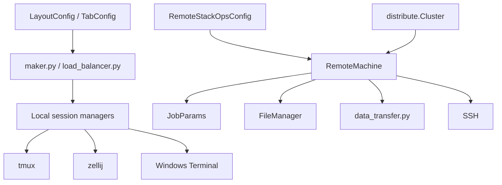

# Cluster API

`stackops.cluster` is the orchestration layer of the library. It combines:

- typed layout definitions
- local and remote session managers
- remote job packaging, transfer, launch, and status tracking

Most higher-level automation code in this area moves through those three pieces in that order.

---

## Topics in this section

| Topic | What it covers | Main modules |
| --- | --- | --- |
| [Layouts](layouts.md) | Layout schema, callable-to-tab builders, layout splitting, backend-specific launchers | `stackops.utils.schemas.layouts.layout_types`, `stackops.cluster.sessions_managers.utils.maker`, `stackops.cluster.sessions_managers.utils.load_balancer`, `stackops.cluster.sessions_managers.{zellij,tmux,windows_terminal}.*` |
| [Sessions](sessions.md) | Conflict planning plus local and remote session managers for zellij, tmux, and Windows Terminal | `stackops.cluster.sessions_managers.session_conflict`, `stackops.cluster.sessions_managers.*_manager` |
| [Remote execution and networking](remote.md) | Remote job models, generated scripts, file transfer, SSH helpers, workload distribution, address helpers | `stackops.cluster.remote.*`, `stackops.utils.ssh`, `stackops.scripts.python.helpers.helpers_network.*` |

---

## Architecture



---

## Common import patterns

```python
from stackops.cluster.remote.distribute import Cluster
from stackops.cluster.remote.models import RemoteStackOpsConfig
from stackops.cluster.remote.remote_machine import RemoteMachine
from stackops.cluster.sessions_managers.tmux.tmux_local_manager import TmuxLocalManager
from stackops.cluster.sessions_managers.zellij.zellij_local_manager import ZellijLocalManager
from stackops.cluster.sessions_managers.utils.maker import make_layout_from_functions
from stackops.utils.schemas.layouts.layout_types import LayoutConfig
```
