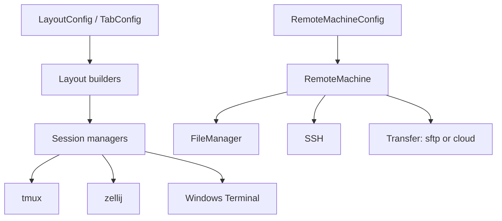

# Cluster API

The `machineconfig.cluster` package is the orchestration layer of the library. It is where typed layout definitions, session managers, SSH helpers, and remote-job models come together.

In practice the cluster APIs fall into three related groups:

- layout building
- session management
- remote execution

---

## Topics in this section

| Topic | What it covers | Main modules |
| --- | --- | --- |
| [Layouts](layouts.md) | Typed layout schema, turning Python callables into tabs, splitting oversized layouts, tmux layout launchers | `machineconfig.utils.schemas.layouts.layout_types`, `machineconfig.cluster.sessions_managers.utils.maker`, `machineconfig.cluster.sessions_managers.utils.load_balancer`, `machineconfig.cluster.sessions_managers.tmux.*` |
| [Sessions](sessions.md) | zellij, tmux, and Windows Terminal managers, conflict handling, session start/attach/status flows | `machineconfig.cluster.sessions_managers.*` |
| [Remote execution and networking](remote.md) | Remote job config models, generated scripts, transfer, firing jobs, SSH, IP helpers | `machineconfig.cluster.remote.*`, `machineconfig.utils.ssh`, `machineconfig.scripts.python.helpers.helpers_network.*` |

---

## Architecture



---

## Common import patterns

```python
from machineconfig.cluster.remote.models import RemoteMachineConfig
from machineconfig.cluster.remote.remote_machine import RemoteMachine
from machineconfig.cluster.sessions_managers.tmux.tmux_local import run_tmux_layout
from machineconfig.cluster.sessions_managers.utils.maker import make_layout_from_functions
from machineconfig.utils.schemas.layouts.layout_types import LayoutConfig
```
