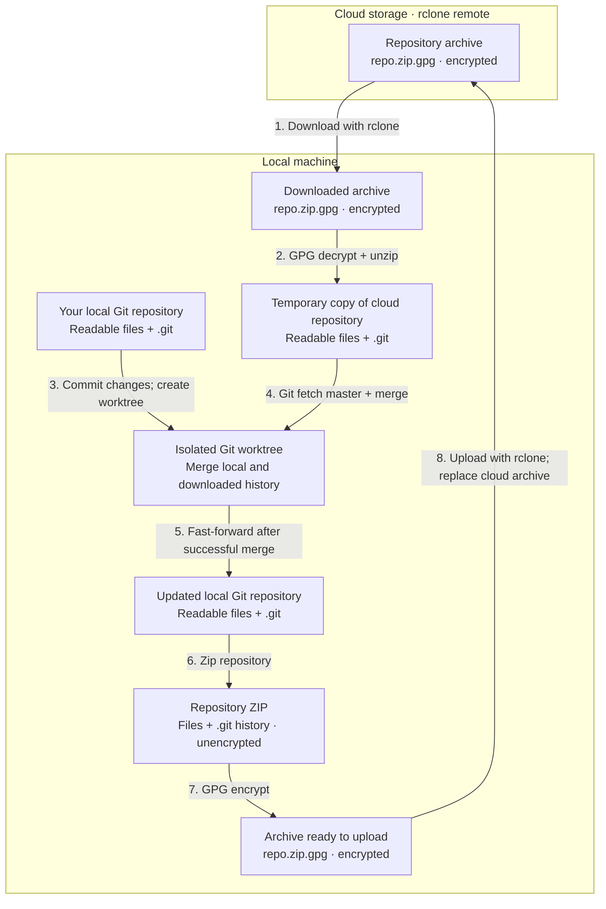

# devops

`devops` is the main operational CLI for package installation, repo automation, config sync, data sync, self-management, networking, script execution, and vault access.

---

## Usage

```bash
devops [OPTIONS] COMMAND [ARGS]...
```

## Current top-level commands

| Command | Purpose |
| --- | --- |
| `install` | Install packages or named groups |
| `repos` | Manage development repositories |
| `config` | Configuration and dotfile workflows |
| `data` | Backup and restore configured data paths; encrypt or decrypt local files and folders |
| `self` | StackOps self-management and developer workflows |
| `network` | Sharing, transfer, address, SSH, and device helpers |
| `execute` | Run scripts from predefined locations or as a raw command |
| `vault` | Search Bitwarden credentials and manage login/unlock state |

---

## `install`

```bash
devops install [OPTIONS] [WHICH]
```

Current options:

- `--group` to treat `WHICH` as a bundle name
- `--source` to select `library`, `user`, or `all` installer catalogs; defaults to `all`
- `--check` to report binary availability without installing or validating catalog entries
- `--interactive` to choose packages interactively
- `--explore` / `-x` to browse installer `categoryLabels` before choosing packages
- `--update` to reinstall or upgrade when supported
- `--version` to request a specific version or tag

Example:

```bash
devops install --group sysabc
devops install --explore
devops install ai-agents-assistants -x
devops install lazygit,fd --update
```

---

## Current command groups

These are the child commands exposed by the current live help.

`repos`:

- `sync`
- `register`
- `action`
- `version`
- `analyze`
- `guard`
- `viz`
- `count-lines`

`config`:

- `interactive`
- `sync`
- `register`
- `edit`
- `export-dotfiles`
- `import-dotfiles`
- `copy-assets`
- `dump`
- `terminal`
- `secrets`
- `setup`

`data`:

- `sync`
- `register`
- `display`
- `subset`
- `edit`
- `encrypt`
- `decrypt`

`self`:

- `install`
- `clone`
- `update`
- `status`
- `security`
- `explore-cli`
- `explore-python-api`
- `readme`
- `docs`
- `build-installer`
- `download-installer`
- `build-docker`
- `build-graph`
- `build-assets`

`network`:

- `share-terminal`
- `share-server`
- `send`
- `receive`
- `share-temp-file`
- `show-address`
- `vscode-share`
- `ssh`
- `cloudflare`
- `device`

`vault`:

- `search`
- `login-and-unlock`
- `unlock`
- `sync`
- `clean-cache`

---

## `repos guard`

`guard` syncs a Git repository through an encrypted archive in cloud storage. Your local working files and `.git` history stay readable; GPG encrypts the archive before upload and decrypts it locally after download. Git handles merging on your machine, while rclone transfers the encrypted archive.

```bash
devops repos guard ~/code/private-repo --cloud myremote --message "sync before travel"
```

When both the local repository and cloud archive exist, the flow is:



- **Encryption:** by default, GPG encrypts to your own key; restoring requires its private key. Supplying `--password` selects symmetric encryption with that password.
- **Archive contents:** repository files and `.git` history are encrypted together. Git-ignored files are excluded by default; `--ignore-gitignore` includes them.
- **First sync:** if the cloud archive is missing, guard commits local changes and publishes the first encrypted archive. If the local repository is missing, it downloads, decrypts, and restores the cloud copy.
- **Conflicts:** guard handles them in the isolated worktree using `--on-conflict` (default: `ask`). Stopping preserves that worktree and the downloaded copy for inspection; the live repository keeps its local commit without receiving merge conflict markers.

---

## `repos version`

Capture and restore named repository states in the workspace's `versions.json`:

| Command | Behavior |
| --- | --- |
| `declare VERSION --message TEXT` | Record repository commits, branches, remote information, and whether each working tree is dirty |
| `status [VERSION]` | List declared versions, or compare one with the current repositories |
| `checkout VERSION` | Restore an existing repository collection to the declared commits and branches; `--dry-run` previews without fetching or changing repositories |

All three accept `--directory`, `-d` to select the workspace; the default is the current directory. `declare --recursive`, `-r` includes nested repositories. Checkout refuses dirty current repositories and versions captured with dirty repositories; it does not clone missing repositories.

```bash
devops repos version declare baseline --message "Before dependency updates" --directory ./workspace
devops repos version status --directory ./workspace
devops repos version status baseline --directory ./workspace
devops repos version checkout baseline --directory ./workspace --dry-run
```

---

## `data encrypt` and `data decrypt`

These local operations use GPG without uploading data or registering a backup entry. `encrypt PATH` accepts a file or folder; folders are archived first. `decrypt PATH` accepts a `.gpg` file and extracts a recognized folder archive after decryption. Both preserve the input and refuse an existing output path.

Both commands accept `--encryption`, `-e` (`symmetric`/`s` or `asymmetric`/`a`), `--password`, `-p`, and `--output`, `-o`. Symmetric encryption is the default and prompts for a password when omitted. For asymmetric encryption, `encrypt --recipient`, `-r` selects a GPG key; otherwise it uses the user's own key. Folder encryption supports `--compression`, `-c` with `zip` (default), `tar.gz`, `tar.bz2`, or `tar.xz`.

```bash
devops data encrypt ./notes.txt
devops data decrypt ./notes.txt.gpg --output ./restored-notes.txt
devops data encrypt ./project --encryption asymmetric --compression tar.gz
devops data decrypt ./project.tar.gz.gpg --encryption asymmetric --output ./restored-project
```

---

## `execute`

```bash
devops execute [OPTIONS] [NAME]
```

Current behavior:

- `NAME` can be a predefined script name or a raw command string
- when `NAME` is a direct script file path, `execute` runs it without searching the configured script roots
- `--source`, `-s` selects search locations: `all`, `repo`, `private`, `public`, `library`, or `dynamic`
- `--source repo` or `-s repo` searches `<git-root>/.stackops/scripts`
- `--interactive` enables interactive selection
- `--command` runs the input as a command
- `--list` prints the available scripts
- `--subprocess`, `-S` runs shell scripts in a child Bash or PowerShell process instead of sourcing them in the caller

Examples:

```bash
devops execute --list
devops execute deploy -s library
devops execute deploy.sh -S
devops execute "echo hello" --command
```

---

## `vault`

```bash
devops vault COMMAND [ARGS]...
```

Current behavior:

- `search` retrieves Bitwarden credentials and can copy password, username, TOTP, or raw JSON to clipboard slots
- `login-and-unlock` loads Bitwarden API credentials from StackOps secrets, unlocks the vault, and saves `BW_SESSION` locally
- `unlock` prints an eval-able shell script that exports the saved `BW_SESSION`
- `sync` synchronizes Bitwarden with the server and refreshes cached searches
- `clean-cache` removes cached search results and any saved session token

Examples:

```bash
devops vault login-and-unlock --account-name dev
devops vault search github --copy password
devops v s github --json
eval "$(devops vault unlock)"
devops vault sync
devops vault clean-cache
```

---

## Working with nested apps

The nested groups above are lazily loaded Typer apps. The exact leaf commands and flags live under those subtrees, so use help at the branch you care about:

```bash
devops repos --help
devops config --help
devops data --help
devops self --help
devops network --help
devops vault --help
devops self docs --help
devops config terminal --help
```
