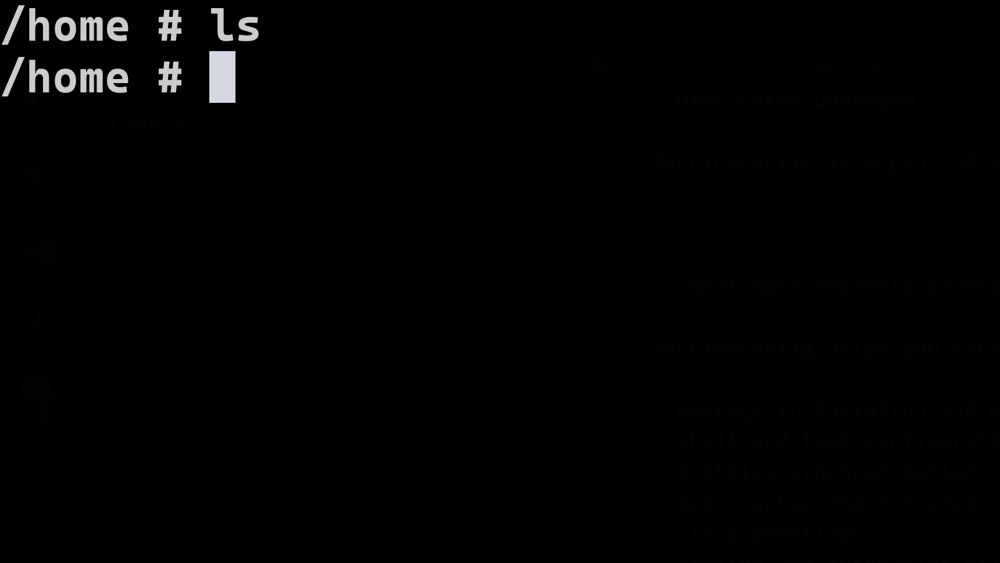
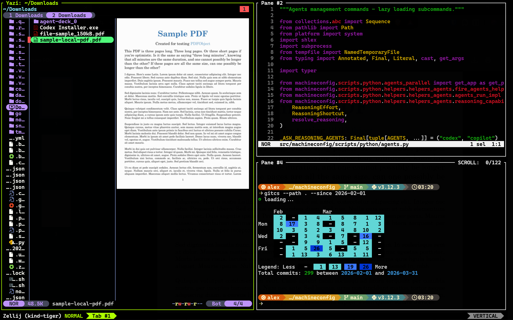

---
hide:
  - navigation
  - toc
---

# **Machineconfig**

### Cross-platform CLI for Stack Management, Setup & Maintenance

[Install with uv](installation.md){ .md-button .md-button--primary }
[Quickstart](quickstart.md){ .md-button }
[View on GitHub](https://github.com/thisismygitrepo/machineconfig){ .md-button }

`1 command + 5 minutes`: from a naked, minimal, freshly purchased/formatted machine to the usable-ready machine that you have been optimizing for 10 years, all your digitial life, sorted out, by 100s of scripts that configure your machine.

| Before | After |
| --- | --- |
|  |  |

---

## What you get

* cross-platform package mangager, top 200 rust-based most popular cli projects on github, and more.
* Dotfile manager:
    * private and public configurations for all those applications and more.
    * secrets, creds, passwords etc.
* data sync solution.
* repositories mapped out for 1-liner backup and retreival.

✅ This covers `100%` of your digital footprint.

Machineconfig does not invent anything, it simply manages the stack that you are comfortable with.

---

-   :material-rocket-launch:{ .lg .middle } **Getting Started**

    ---

    Install Machineconfig and verify the active command surface.

    [:octicons-arrow-right-24: Installation](installation.md)

-   :material-run-fast:{ .lg .middle } **Quickstart**

    ---

    Follow a short path through help, shell setup, install, and sync commands.

    [:octicons-arrow-right-24: Quickstart](quickstart.md)

-   :material-console:{ .lg .middle } **CLI Reference**

    ---

    Browse the full command reference.

    [:octicons-arrow-right-24: CLI Reference](cli/index.md)

-   :material-api:{ .lg .middle } **API Reference**

    ---

    Explore the Python API and internals.

    [:octicons-arrow-right-24: API Reference](api/index.md)

