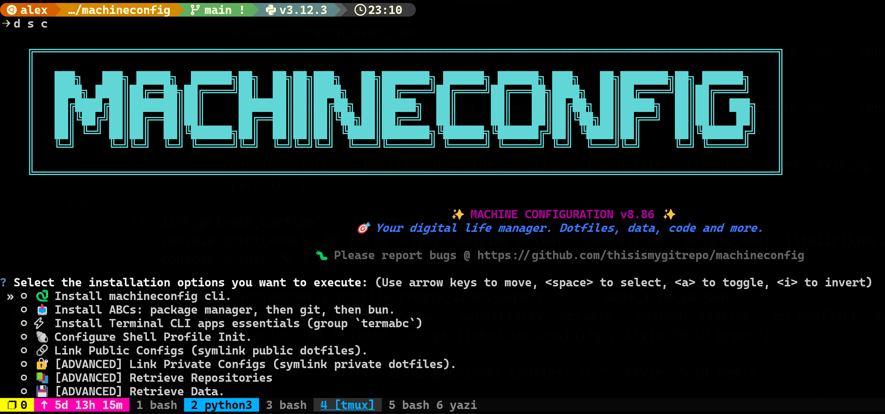

# Quickstart

## Good first commands (install System ABC's, configure cli's & init the shell profile)


You interactively start with `devops config config`, which gives selection menu:



Behind the scense, its simply running the commands below, in case you want to script it later on:

```bash

devops install --group sysabc  # Install (if missing) the underlying package managers (apt or brew or winget)
devops config copy-assets all  # copy config files to machine
devops config sync down --sensitivity public --method copy --on-conflict throw-error --which all  # link config files
devops config terminal config-shell --which default  # add alias to shell (pwsh, zsh or bash)
devops install --group termabc  # install the basic terminal cli's
# restart your shell ... you should see a difference.
```


## Install tools

Interactive flow:

```bash
devops install --interactive
```

If you already know the bundle you want:

```bash
devops install --group <group-name>
```

Check the live help before choosing names:

```bash
devops install --help
```

## Inspect config and data sync workflows

```bash
devops config sync --help
devops data sync --help
```

These help screens show the current required arguments and options for dotfiles/config sync and backup sync.

## 5. Explore the rest of the CLI

```bash
cloud --help
terminal --help
agents --help
utils --help
croshell --help
```


## Next steps

<div class="grid cards" markdown>

-   :material-book-open-variant:{ .lg .middle } **User Guide**

    ---

    Continue to the broader documentation.

    [:octicons-arrow-right-24: User Guide](guide/overview.md)

-   :material-console:{ .lg .middle } **CLI Reference**

    ---

    Browse the full command reference.

    [:octicons-arrow-right-24: CLI Reference](cli/index.md)

</div>
