## self

Self management commands.

```bash
devops self [SUBCOMMAND] [ARGS]...
```

Manage machineconfig itself: upgrades, bootstrap scripts, install flows, docs preview, CLI graph exploration, and repo-local developer utilities.

Current `devops self --help` exposes:

| Command | Description | Availability |
|---------|-------------|--------------|
| `update` | Upgrade machineconfig and optionally refresh copied assets or public config links | Always |
| `init` | Print or run packaged init/setup scripts | Always |
| `status` | Inspect shell profile, apps, symlinks, dotfiles, and related machine state | Always |
| `install` | Install machineconfig locally, export an offline image, or run the interactive setup flow | Always |
| `explore` | Inspect the CLI graph in terminal, DOT, Plotly, or TUI form | Always |
| `buid-docker` | Build Docker images from the repo script | Only when `~/code/machineconfig` exists |
| `security` | Run security and installer-audit helpers | Only when `~/code/machineconfig` exists |
| `docs` | Serve the local docs preview, optionally after rebuilding | Only when `~/code/machineconfig` exists |
| `readme` | Fetch and render the project README in the terminal | Always |

The nested help screens render shortened usage such as `Usage: devops update ...`, but the full entrypoints remain `devops self ...` and `devops self security ...`.

### update

Upgrade the installed tool and optionally re-apply local assets or public configs.

```bash
devops self update [OPTIONS]
```

Key options from current help:

| Option | Description |
|--------|-------------|
| `--assets-copy`, `-a` | Copy packaged assets onto the current machine after the update |
| `--link-public-configs`, `-b` | Re-link public configs after the update |

Current behavior:

- If `~/code/machineconfig` exists, the command runs `uv self update`, `git pull`, and reinstalls the repo checkout as an editable tool.
- Otherwise it updates `uv` and upgrades the installed `machineconfig` tool package.
- On non-Windows platforms, `--assets-copy` and `--link-public-configs` trigger follow-up local configuration work after the tool update.

Examples:

```bash
devops self update
devops self update --no-assets-copy
devops self update --link-public-configs
```

### init

Print one of the packaged init/setup scripts, or execute it immediately with `--run`.

```bash
devops self init [OPTIONS] [WHICH]
```

Supported `WHICH` values from current help:

| Value | Meaning |
|-------|---------|
| `init` | Print the shell init script for the current platform |
| `ia` | Print the interactive setup bootstrap script |
| `live` | Print the live-from-GitHub bootstrap script |

Key option:

| Option | Description |
|--------|-------------|
| `--run`, `-r` | Run the selected script instead of printing it |

Examples:

```bash
devops self init
devops self init ia
devops self init live --run
```

### status

Run the self-audit report for the current machine.

```bash
devops self status
```

This command delegates to the status helper that inspects installed tools, shell profile state, symlinks, and managed config layout.

### install

Install machineconfig, clone a local development checkout when requested, export an offline image, or hand off to the interactive setup flow.

```bash
devops self install [OPTIONS]
```

Key options from current help:

| Option | Description |
|--------|-------------|
| `--copy-assets`, `-a` | Copy packaged assets after installation |
| `--dev`, `-d` | Install from a local development checkout instead of PyPI |
| `--export`, `-e` | Export installation files for an offline image |
| `--interactive`, `-i` | Run the interactive configuration flow instead of a direct install |

Current behavior:

- `--interactive` switches into the guided setup flow immediately.
- `--export` produces the offline-installation image and exits.
- `--dev` clones `~/code/machineconfig` first when that checkout does not already exist, then installs it editable.
- Without a local checkout, the default path installs the published tool package.

Examples:

```bash
devops self install
devops self install --dev
devops self install --interactive
devops self install --export
```

### explore

CLI graph inspection lives under a nested Typer app:

```bash
devops self explore [SUBCOMMAND] [ARGS]...
```

Current `devops self explore --help` exposes:

| Command | Description |
|---------|-------------|
| `search` | Search all `cli_graph.json` command entries |
| `tree` | Render a rich tree view in the terminal |
| `dot` | Export the graph as Graphviz DOT |
| `sunburst` | Render a Plotly sunburst view |
| `treemap` | Render a Plotly treemap view |
| `icicle` | Render a Plotly icicle view |
| `tui` | Open the full-screen Textual navigator |

#### search

Interactive fuzzy-search over the generated CLI graph JSON. By default it runs `--help`
for the selected command or group; use `--show-json` to print the raw graph entry.

```bash
devops self explore search [OPTIONS]
```

Key option:

| Option | Description |
|--------|-------------|
| `--graph-path`, `-g` | Override the path to `cli_graph.json` |
| `--show-json` | Print the selected `cli_graph.json` entry instead of running help |

Representative JSON result excerpt:

```json
{
  "kind": "command",
  "name": "tree",
  "help": "🌳 <t> Render a rich tree view in the terminal.",
  "source": {
    "file": "src/machineconfig/scripts/python/graph/visualize/cli_graph_app.py",
    "module": "machineconfig.scripts.python.graph.visualize.cli_graph_app",
    "callable": "tree"
  }
}
```

#### tree

Render the graph as a terminal tree.

```bash
devops self explore tree [OPTIONS]
```

Key options from current help:

| Option | Description |
|--------|-------------|
| `--show-help` | Include help text in each node label |
| `--show-aliases` | Include hidden aliases in labels |
| `--max-depth`, `-d` | Limit the rendered depth |

Example:

```bash
devops self explore tree --max-depth 2
```

Representative output:

```text
mcfg - MachineConfig CLI - Manage your machine configurations and workflows
├── devops - 🔧 DevOps operations
│   ├── install - 🔧 <i> Install essential packages
│   ├── repos - 📁 <r> Manage development repositories
│   ├── config - 🧰 <c> configuration subcommands
│   ├── data - 🗄 <d> Backup and retrieve configuration files and directories to/from cloud storage using rclone.
│   ├── self - 🔄 <s> self operations subcommands
│   ├── network - 🔐 <n> Network subcommands
│   └── execute - 🚀 <e> Execute python/shell scripts from pre-defined directories or as command
├── cloud - ☁ Cloud management commands
├── sessions - Layouts management subcommands
├── agents - 🤖 AI Agents management subcommands
├── utils - ⚙ utilities operations
├── fire - <f> Fire and manage jobs
└── croshell - <r> Cross-shell command execution
```

#### dot

Export the graph as Graphviz DOT text.

```bash
devops self explore dot [OPTIONS]
```

Key options from current help:

| Option | Description |
|--------|-------------|
| `--output`, `-o` | Write DOT output to a file |
| `--include-help` | Include help text in labels |
| `--max-depth`, `-d` | Limit the exported depth |

Example:

```bash
devops self explore dot --max-depth 2
```

Representative output:



```dot
digraph cli_graph {
  graph [rankdir=LR, splines=true, bgcolor="white"];
  node [shape=box, style="rounded,filled", fontname="Helvetica", fontsize=10, color="#333333"];
  edge [color="#999999"];
  "mcfg" [label="mcfg\nMachineConfig CLI - Manage your machine configurations and workflows", shape="doubleoctagon", fillcolor="#f1f1f1", color="#555555"];
  "mcfg devops" [label="devops\n🔧 DevOps operations", shape="box", fillcolor="#dbeafe", color="#2563eb"];
  "mcfg" -> "mcfg devops";
  "mcfg devops self" [label="self\n🔄 <s> self operations subcommands", shape="box", fillcolor="#dbeafe", color="#2563eb"];
  "mcfg devops" -> "mcfg devops self";
}
```

#### sunburst

Render the graph as a Plotly sunburst view.

```bash
devops self explore sunburst [OPTIONS]
```

Key options from current help:

| Option | Description |
|--------|-------------|
| `--output`, `-o` | Write HTML or image output |
| `--max-depth`, `-d` | Limit the exported depth |
| `--template` | Plotly template name |
| `--height` | Static image height |
| `--width` | Static image width |

Example:

```bash
devops self explore sunburst --output docs/assets/devops-self-explore/sunburst.html --template plotly_dark
```

<iframe
  class="plotly-preview-frame"
  src="../assets/devops-self-explore/sunburst.html"
  title="Interactive sunburst preview"
  loading="lazy"
></iframe>

Standalone HTML result: [sunburst.html](../assets/devops-self-explore/sunburst.html)

#### treemap

Render the graph as a Plotly treemap view.

```bash
devops self explore treemap [OPTIONS]
```

The option set matches `sunburst`: `--output`, `--max-depth`, `--template`, `--height`, and `--width`.

Example:

```bash
devops self explore treemap --output docs/assets/devops-self-explore/treemap.html --template plotly_dark
```

<iframe
  class="plotly-preview-frame"
  src="../assets/devops-self-explore/treemap.html"
  title="Interactive treemap preview"
  loading="lazy"
></iframe>

Standalone HTML result: [treemap.html](../assets/devops-self-explore/treemap.html)

#### icicle

Render the graph as a Plotly icicle view.

```bash
devops self explore icicle [OPTIONS]
```

The option set matches `sunburst`: `--output`, `--max-depth`, `--template`, `--height`, and `--width`.

Example:

```bash
devops self explore icicle --output docs/assets/devops-self-explore/icicle.html --template plotly_dark
```

<iframe
  class="plotly-preview-frame"
  src="../assets/devops-self-explore/icicle.html"
  title="Interactive icicle preview"
  loading="lazy"
></iframe>

Standalone HTML result: [icicle.html](../assets/devops-self-explore/icicle.html)

#### tui

Open the full-screen Textual navigator.

```bash
devops self explore tui
```

Interactive controls:

- `/` focuses search
- `c` copies the selected command
- `r` runs the selected command
- `b` builds the selected command with arguments
- `?` opens in-app help
- `q` quits

No static screenshot is checked into the docs for the TUI. Launch it locally to inspect the current command tree.

### buid-docker

Build the repo Docker image variants through the checked-in shell wrapper.

```bash
devops self buid-docker [VARIANT]
```

Supported variants from current help:

| Variant | Meaning |
|---------|---------|
| `slim` | Build the slim image |
| `ai` | Build the AI-oriented image |

Example:

```bash
devops self buid-docker ai
```

This command is only registered when `~/code/machineconfig` exists locally.

### security

Security helpers live under a nested Typer app:

```bash
devops self security [SUBCOMMAND] [ARGS]...
```

Current `devops self security --help` exposes:

| Command | Description |
|---------|-------------|
| `scan` | Scan installed apps or a single file with VirusTotal |
| `list` | List installed apps, optionally filtered by name |
| `upload` | Upload a local file to the project cloud storage |
| `download` | Download a file from Google Drive |
| `install` | Install safe apps from the saved app metadata report |
| `repo-licenses` | Download GitHub repo license files for installer entries |
| `report` | Inspect saved scan reports, raw rows, or summary statistics |

#### scan

Scan installed apps or one local file path with VirusTotal.

```bash
devops self security scan [OPTIONS] [APPS]
```

Key options from current help:

| Option | Description |
|--------|-------------|
| `APPS` | Optional comma-separated app names to scan |
| `--path` | Scan one explicit file path instead of installed apps |
| `--record`, `--no-record` | Control whether the result is saved into the repo reports |

Examples:

```bash
devops self security scan
devops self security scan git,uv
devops self security scan --path ./downloads/tool.exe --no-record
```

#### list

List the installed CLI apps that the security tooling knows how to inspect.

```bash
devops self security list [APPS]
```

Example:

```bash
devops self security list git,uv
```

#### upload

Upload one local file into the cloud storage used by the security workflow.

```bash
devops self security upload PATH
```

Example:

```bash
devops self security upload ./dist/tool.exe
```

#### download

Download a previously shared file from Google Drive.

```bash
devops self security download URL
```

The argument can be a full Google Drive URL or a raw file id.

#### install

Install a safe app from the saved metadata report.

```bash
devops self security install NAME
```

`NAME` can be one app entry from the report or the special `essentials` bundle.

#### repo-licenses

Download GitHub license files for repos referenced by the installer metadata.

```bash
devops self security repo-licenses [OPTIONS]
```

Key option:

| Option | Description |
|--------|-------------|
| `--github-token` | GitHub token, also read from `MACHINECONFIG_GITHUB_TOKEN`, `GITHUB_TOKEN`, or `GH_TOKEN` |

#### report

Inspect saved report data in full, summary, table, or CSV form. The default invocation shows the full engine-level report.

```bash
devops self security report [OPTIONS] [APPS]
```

Key options from current help:

| Option | Description |
|--------|-------------|
| `APPS` | Optional comma-separated app names to filter on |
| `--view`, `-v` | Choose `engines`, `app-summary`, `apps`, `options`, or `stats` |
| `--format`, `-f` | Choose `table` or `csv` output for the raw `apps` and `engines` views |

Examples:

```bash
devops self security report
devops self security report --view app-summary
devops self security report --view stats
devops self security report uv --view apps --format csv
devops self security report git --view engines
```

This command is only registered when `~/code/machineconfig` exists locally.

### docs

Serve the local docs preview and print the localhost and LAN URLs.

```bash
devops self docs [OPTIONS]
```

Key options:

| Option | Description |
|--------|-------------|
| `--rebuild`, `-b` | Rebuild the docs before starting the preview server |
| `--create-artifacts`, `-a` | Regenerate the Plotly CLI graph HTML artifacts before serving |

Current behavior:

- Prints `http://127.0.0.1:8000/machineconfig/` and, when available, the LAN preview URL.
- With `--rebuild`, syncs the changelog and runs `zensical build` before `zensical serve`.
- With `--create-artifacts`, refreshes the checked-in CLI graph HTML exports under `docs/assets/devops-self-explore/`.
- Serves on `0.0.0.0:8000`.

Examples:

```bash
devops self docs
devops self docs --rebuild
devops self docs --rebuild --create-artifacts
```

### readme

Fetch the project README from GitHub and render it as rich Markdown in the terminal.

```bash
devops self readme
```

This is useful when the repo checkout is not open locally but you still want the current upstream README rendered in the terminal.

---
